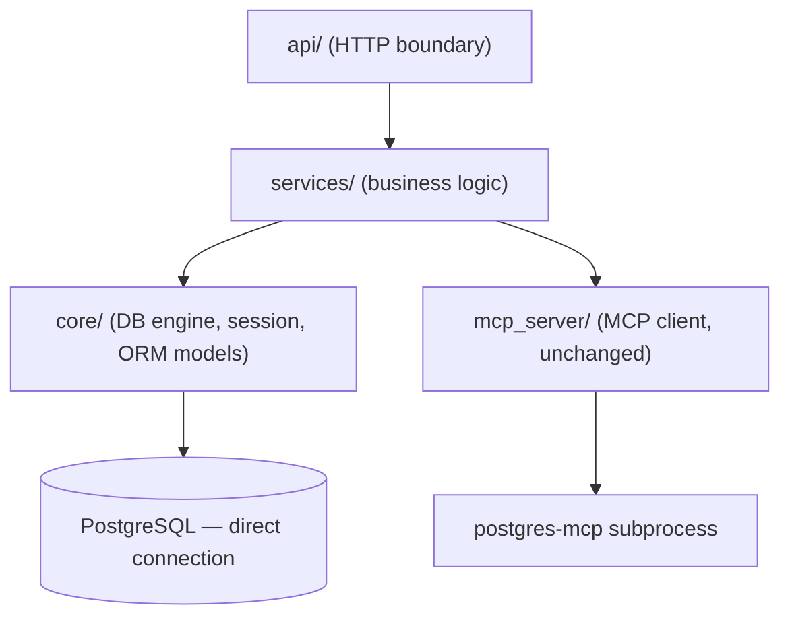
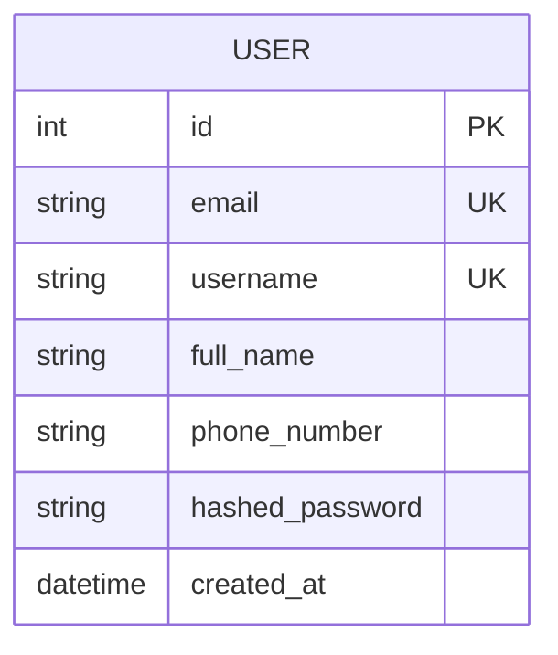

# Architecture Spine — Secure Authentication System — User Registration MVP

## Design Paradigm

Layered / service-oriented, matching the existing app: `api/` (HTTP boundary) → `services/` (business logic) → `core/` (shared infra) / `mcp_server/` (MCP client, unchanged). No hexagonal/clean-architecture split — same pattern the rest of the repo already uses. `core/` already exists as an empty placeholder package; this build is the first to put it to use, not the one that creates it.

## Invariants & Rules



`core/` and `mcp_server/` never depend on each other — both are leaves reachable only through `services/`, and each owns a separate path to the same Postgres instance.

### AD-1 — Registration is for real end-user accounts [ADOPTED]

- **Binds:** all auth/registration work
- **Prevents:** building a thin API-key/service-auth gate when a full user identity model is what's actually needed
- **Rule:** auth centers on a persisted `User` identity, not a shared secret or service token

### AD-2 — Auth owns direct Postgres access, separate from the MCP proxy path [ADOPTED]

- **Binds:** `users` table CRUD, migrations, credential storage
- **Prevents:** password/credential writes going through a generic LLM-facing SQL-execution MCP tool (security and transactional-integrity risk); two DB-access paradigms competing for the same tables
- **Rule:** all auth data access goes through the app's own SQLAlchemy layer (`core/db.py`); `postgres-mcp` is never used for auth reads or writes
- **Note:** this rule constrains this app's own code only. It does **not** by itself stop `postgres-mcp` — which currently connects with the same `DATABASE_URI`/DB role — from being able to query the `users` table once it exists (the LLM chat path could run `execute_sql` against it directly). **Accepted risk for this MVP** (explicit user decision) — no DB-level role restriction is being added in this pass; see Deferred.

### AD-3 — Session strategy is JWT (stateless), no server-side session store [ADOPTED]

- **Binds:** future login/session work (not built this pass — see Deferred)
- **Prevents:** a later builder introducing a parallel session-store mechanism (e.g. Redis-backed sessions) for the same login state
- **Rule:** when login ships, it issues signed JWTs; no session table/store is introduced for auth state

### AD-4 — This build scopes to registration only [ADOPTED]

- **Binds:** this pass's endpoint surface
- **Prevents:** scope creep into login/token-issuance/refresh flows before registration itself is solid
- **Rule:** this pass ships account creation only; no `/auth/login` endpoint, no token issuance

### AD-5 — Auth code follows the existing layered pattern; `core/` becomes shared DB infra [ADOPTED]

- **Binds:** file/module placement for all auth code
- **Prevents:** a self-contained `auth/` package diverging from the repo's "one pattern per concern" convention; a later feature inventing a second DB-engine setup
- **Rule:** router in `api/auth.py`, business logic in `services/auth_service.py`; `core/` holds the SQLAlchemy async engine/session and the `User` ORM model as infra any future feature can reuse

### AD-6 — DB access is async (SQLAlchemy async engine + `asyncpg`) [ADOPTED]

- **Binds:** `core/db.py` and all auth DB calls
- **Prevents:** a sync DB call blocking the event loop in an otherwise fully async app (`AsyncOpenAI`, async MCP client)
- **Rule:** all auth DB access uses `AsyncSession`/`asyncpg`; no sync SQLAlchemy engine is introduced

### AD-7 — Auth errors map to real 4xx status codes [ADOPTED]

- **Binds:** `services/auth_service.py` → `api/auth.py` error translation
- **Prevents:** auth's client-caused errors (duplicate email/username, invalid input) being flattened into the existing blanket `HTTPException(502)` pattern, which is correct only for MCP/tool failures; a check-then-insert race under concurrent registrations; hashing whatever password string is submitted
- **Rule:** `api/auth.py` maps duplicate email/username to `409`, validation failures (including a minimum password length, rejected before hashing) to `422`; `502` stays reserved for genuine upstream (MCP/LLM) failures. Duplicate detection is insert-then-catch against the DB unique constraint (`IntegrityError`), never check-then-insert. `detail` stays a flat string, not a structured/field-keyed object.

### AD-8 — Engine lifecycle and session scope are explicit [ADOPTED]

- **Binds:** `core/db.py`, `services/auth_service.py`
- **Prevents:** one builder eagerly constructing the engine at import time while another follows the existing `MCPManager` lifespan pattern; one builder holding a shared/singleton `AsyncSession` (mirroring `ChatService`'s singleton style) while another injects a fresh per-request session — the former risks silent, load-dependent corruption under concurrent requests
- **Rule:** `core/db.py`'s `AsyncEngine` is constructed and disposed via FastAPI's `lifespan` hook, same as `MCPManager`. `services/auth_service.py` obtains a new `AsyncSession` per request via FastAPI `Depends`; no session is ever shared across requests.

## Consistency Conventions

| Concern | Convention |
| --- | --- |
| Naming | `users` table (snake_case columns), `User` ORM class; routes under `/auth` prefix (e.g. `POST /auth/register`) |
| Data & formats | Error body stays `{"detail": "..."}`, matching existing endpoints; `409` duplicate email/username, `422` invalid input — auth only, `/chat` and `/mcp/call` keep their existing `502` pattern |
| State & cross-cutting | `core/db.py` owns the single `AsyncEngine`/`async_sessionmaker`; `services/auth_service.py` is the only writer to `users`; `DATABASE_URI` is read in exactly one place — `config.py`'s existing loader, extended, not a second `os.environ.get()` call in `core/db.py`; passwords are stored only as Argon2id hashes — never logged, never returned in any response |
| API response shape | `POST /auth/register`'s success response returns only non-sensitive fields (`id`, `email`) — `phone_number`, `full_name`, and `hashed_password` are never echoed back in any response |

## Stack

| Name | Version |
| --- | --- |
| SQLAlchemy (async) | 2.0.51 |
| asyncpg | 0.31.0 |
| alembic | 1.18.5 |
| argon2-cffi | 25.1.0 |

## Structural Seed

```text
mcp-tool-calling/
  api/
    auth.py           # POST /auth/register
  services/
    auth_service.py   # registration logic: validation, uniqueness checks, Argon2id hashing, error mapping
  core/
    db.py             # AsyncEngine + async_sessionmaker, reads DATABASE_URI
    models.py          # User ORM model
  alembic/
    versions/          # migration scripts
  alembic.ini
```



## Deferred

- **`postgres-mcp` DB-role restriction (accepted risk)** — `postgres-mcp` connects with the same `DATABASE_URI`/DB role as the new auth code and can already run `execute_sql` against `users` once it exists, exposing hashed passwords/PII to the LLM chat path. User explicitly accepted this risk for this MVP rather than restricting the role now. **Revisit before production use or before this app handles real user data at scale** — the fix is a separate, restricted Postgres role/grants for `postgres-mcp`'s connection excluding `users`.
- **Login, JWT issuance, token refresh** — planned direction is set (AD-3), not built this pass.
- **JWT signing-secret storage and rotation** — unresolved; the repo's only precedent (`OPENAI_API_KEY` in `.env`) isn't necessarily right for a signing key. Decide when login is actually designed.
- **Token revocation / logout strategy** — a known open weakness of stateless JWTs; not resolved by AD-3's choice of JWT and must be addressed alongside login.
- **Password reset, email verification, RBAC** — named in the original brainstorm as later extensions; out of scope here.
- **Automated test coverage** — no pytest/test-DB introduced for this pass; the repo has none today and this doesn't start one.
- **Deployment/environment envelope** — no Dockerfile, CI/CD, or IaC exists anywhere in this repo yet; how/when Alembic migrations run in any deployed environment is unresolved.
- **Registration abuse protection** (rate limiting, bot/spam mitigation on `POST /auth/register`) — not discussed during coaching; flagged here as a real gap for a security-facing endpoint rather than silently assumed away.
- **Email/username-enumeration hardening** — AD-7's `409` on duplicate email/username reveals whether an account already exists. Whether to soften this (generic response) is an open UX/security trade-off, not decided here.
